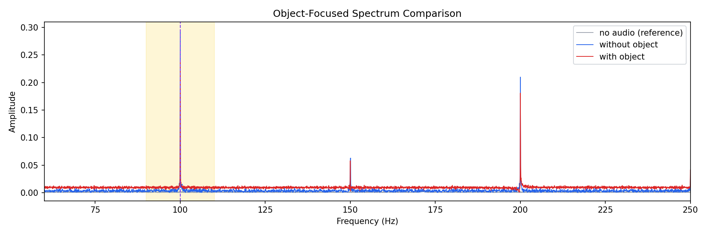
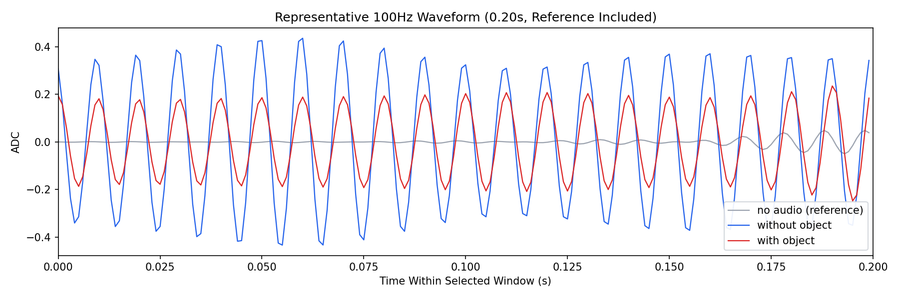
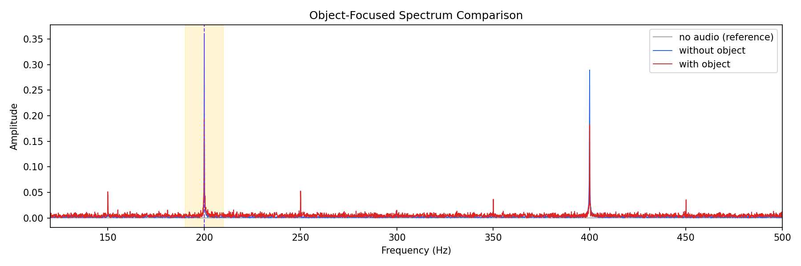
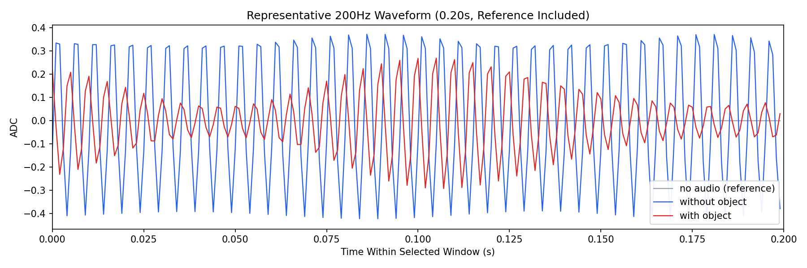
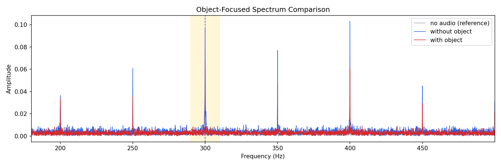
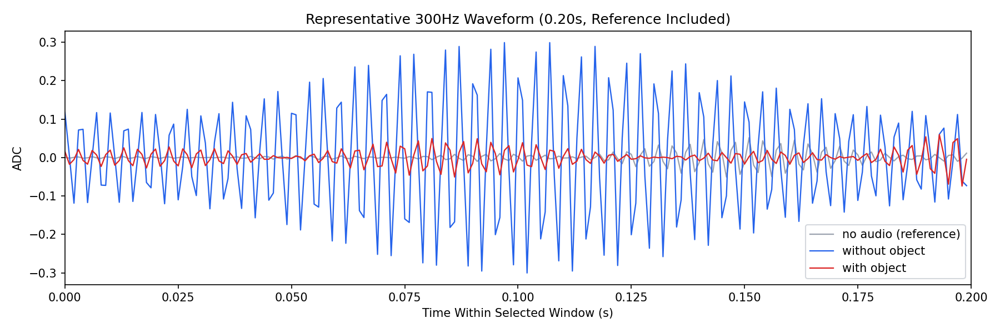

# 100Hz、200Hz、300Hz 三态异物检测实验汇报

## 1. 标题与实验概述

本汇报基于当前已经完成标准化导出的三档实验数据，对 `100Hz`、`200Hz`、`300Hz` 三个激励频点下的土壤振动三态响应进行对比分析。三态分别为 `no audio`（无激励背景）、`without object`（有激励无异物）和 `with object`（有激励有异物）。当前每个频点均包含 `5` 次重复实验，并已在 `Out_Pic` 中完成频谱图、代表波形图和细节波形图的统一导出。

本报告的目标是回答三个问题：第一，目标频点能量是否能够稳定高于背景；第二，加入异物后响应幅值是否出现可重复的衰减；第三，在当前已完成的三个频点中，哪一个频点更适合作为后续异物检测的优先工作点。

基于现有数据，本文的固定结论如下：

- `200Hz` 是当前阶段综合表现最优的候选频点。
- `300Hz` 对异物更敏感，但重复间波动较大，稳定性不足。
- `100Hz` 可以观察到有无异物差异，但区分强度弱于 `200Hz` 与 `300Hz`。

## 2. 数据范围与实验设计

### 2.1 数据范围

- 频点范围：`100Hz`、`200Hz`、`300Hz`
- 每个频点重复次数：`5`
- 每次实验状态：`no audio`、`without object`、`with object`
- 当前汇报仅覆盖 `Out_Pic` 中已完成汇总的三档频点，不包含 `400Hz` 到 `1000Hz`

### 2.2 分析口径

- 采样率采用当前实验脚本默认配置：`1000Hz`
- 目标带通范围采用目标频率 `±10Hz`
- 代表波形窗口长度为 `0.20s`
- 本报告主判据采用 `window_filtered_target_amp_mean`
- 图像选取规则固定为：在每个频点的 `5` 次重复中，选择 `with / without` 主指标比值最接近该频点中位数的重复次作为代表图

按上述规则，三个频点最终选中的代表重复次均为 `repeat_03`。

## 3. 指标说明

| 指标 | 含义 | 在本报告中的作用 |
| --- | --- | --- |
| `window_filtered_target_amp_mean` | 目标带通后，在窗口级统计得到的平均目标幅值 | 主比较指标，用于判断异物引起的幅值衰减 |
| `filtered_target_amp` | 全时域带通后在目标频率处的幅值 | 用于验证目标频点峰值是否清晰存在 |
| `filtered_energy_ratio` | 目标带通能量占总能量的比例 | 用于辅助判断频带内能量集中程度 |
| `with / without` 衰减比 | 有异物主指标与无异物主指标的比值 | 越小表示异物引起的抑制越明显 |
| `CV` | 标准差与均值之比 | 用于衡量重复间稳定性，越小越稳定 |
| `effect size (d)` | 无异物与有异物主指标均值差相对合并标准差的比值 | 用于衡量组间分离度，越大越有利于检测 |
| 背景对比倍数 | 主指标均值与背景参考幅值均值之比 | 用于衡量目标频点相对背景的可见性 |

## 4. 总体结果表

表 1 给出了三档频点的核心统计结果。主指标单位为归一化后的 `ADC` 幅值。

| 频率 | 无异物主指标均值 ± 标准差 | 有异物主指标均值 ± 标准差 | 衰减比 `with / without` | 相对背景倍数 `without / background` | 稳定性说明 | 结论标签 |
| --- | --- | --- | --- | --- | --- | --- |
| `100Hz` | `0.2728 ± 0.0539` | `0.2375 ± 0.0377` | `0.891 ± 0.147` | `136.7×` | `CV=0.20 / 0.16`，重复性较好 | 可区分，但不是首选 |
| `200Hz` | `0.4296 ± 0.1392` | `0.2820 ± 0.1023` | `0.656 ± 0.181` | `832.5×` | `CV=0.32 / 0.36`，波动中等 | 综合最优 |
| `300Hz` | `0.1218 ± 0.0631` | `0.0666 ± 0.0545` | `0.530 ± 0.219` | `64.6×` | `CV=0.52 / 0.82`，波动偏大 | 敏感但不稳 |

表 2 给出两个辅助指标，用于补充判断频带内能量集中程度与组间分离度。

| 频率 | 无异物 `filtered_energy_ratio` | 有异物 `filtered_energy_ratio` | `effect size (d)` | 解释 |
| --- | --- | --- | --- | --- |
| `100Hz` | `0.302 ± 0.054` | `0.214 ± 0.076` | `0.760` | 分离度中等，带内能量在有异物时下降 |
| `200Hz` | `0.289 ± 0.199` | `0.346 ± 0.120` | `1.208` | 分离度最大，但能量占比并未同步下降 |
| `300Hz` | `0.161 ± 0.060` | `0.102 ± 0.057` | `0.937` | 衰减明显，但整体幅值偏低且波动更大 |

## 5. 100Hz 分析

### 5.1 定量结果

`100Hz` 条件下，无异物主指标均值为 `0.2728`，有异物主指标均值为 `0.2375`，平均衰减比为 `0.891`，对应幅值下降约 `10.9%`。该频点的背景对比倍数约为 `136.7×`，说明目标频点本身明显高于背景噪声；同时无异物和有异物两组的 `CV` 分别为 `0.20` 和 `0.16`，说明重复间稳定性在三档频点中相对较好。

从组间分离度看，`100Hz` 的 `effect size` 为 `0.760`，属于中等分离水平。这意味着该频点能够观察到异物导致的抑制现象，但抑制强度并不突出，若后续直接用于判别，仍需要结合其他特征增强决策鲁棒性。

### 5.2 图像观察

*图 1 100Hz 代表频谱图（repeat_03）。目标带位于 100Hz 附近，200Hz 倍频峰仍然较强。*

*图 2 100Hz 代表带通波形图（repeat_03）。有异物时振幅整体下降，但与无异物曲线仍较为接近。*

### 5.3 现象解释

从频谱图看，`100Hz` 目标峰存在且明显高于背景，但 `200Hz` 倍频分量同样较强，此外在 `150Hz` 附近可见一定侧峰响应。这说明 `100Hz` 激励虽然能够稳定驱动系统，但频率选择性并不理想，目标峰并不是唯一突出的能量集中点。

从代表波形看，有异物曲线相对于无异物曲线存在连续的振幅压缩，但压缩幅度有限，且在多数周期内两条曲线的形态依旧接近。因此，`100Hz` 更适合作为低频参考工况，用于辅助判断系统是否进入有效响应状态，而不是当前阶段的首选检测频点。

## 6. 200Hz 分析

### 6.1 定量结果

`200Hz` 是三档频点中综合表现最好的工作点。无异物主指标均值达到 `0.4296`，为三档频点最高；有异物主指标均值为 `0.2820`，平均衰减比为 `0.656`，对应幅值下降约 `34.4%`。这一衰减既显著强于 `100Hz`，又比 `300Hz` 保持了更好的重复性。

该频点相对背景的倍数达到 `832.5×`，说明在当前三档频点中，`200Hz` 的目标响应最容易从背景中被识别出来。与此同时，`effect size` 达到 `1.208`，为三档频点最大，表明无异物与有异物两组之间的统计分离度最强，最有利于后续建立阈值或分类器。

需要注意的是，`200Hz` 的 `filtered_energy_ratio` 在有异物条件下均值略高于无异物条件下均值（`0.346` 对 `0.289`）。这说明带内能量占比并未简单地随异物增加而下降，频谱中可能出现了能量重分配现象。因此，在 `200Hz` 条件下，`window_filtered_target_amp_mean` 仍然比单纯的带通能量占比更适合作为主判据。

### 6.2 图像观察

*图 3 200Hz 代表频谱图（repeat_03）。200Hz 目标峰清晰，400Hz 倍频峰也较明显，但目标峰仍然具有主导地位。*

*图 4 200Hz 代表带通波形图（repeat_03）。有异物时波形幅值明显压缩，且在整个窗口内持续存在。*

### 6.3 现象解释

从频谱角度看，`200Hz` 条件下目标峰清晰且稳定，高于背景参考很多数量级；同时 `400Hz` 处存在较明显倍频峰，且在 `150Hz`、`250Hz`、`350Hz`、`450Hz` 一带可以观察到一定的边带或杂散响应。即便如此，目标峰仍保持主导地位，没有被其他频点淹没。

从代表波形看，有异物曲线相对于无异物曲线在整个 `0.20s` 窗口内都呈现出稳定压缩，且相位形态仍较一致。这种“高信号强度 + 明显幅值抑制 + 可接受的重复波动”组合，使 `200Hz` 成为当前阶段最均衡、最适合继续推进的工作点。

## 7. 300Hz 分析

### 7.1 定量结果

`300Hz` 的平均衰减比为 `0.530`，对应幅值下降约 `47.0%`，是三档频点中对异物最敏感的频点。然而，这一优势伴随着明显的稳定性下降。无异物组和有异物组的 `CV` 分别达到 `0.52` 和 `0.82`，说明重复间波动已经明显大于 `100Hz` 和 `200Hz`。

此外，`300Hz` 的无异物主指标均值仅为 `0.1218`，显著低于 `200Hz`；其相对背景倍数约为 `64.6×`，也低于 `100Hz` 与 `200Hz`。因此，尽管其异物响应最敏感，但可用信号余量与稳健性都不理想。`effect size=0.937` 表明组间仍然可以分开，但并未超过 `200Hz`。

### 7.2 图像观察

*图 5 300Hz 代表频谱图（repeat_03）。300Hz 目标峰存在，但 350Hz、400Hz、450Hz 等邻近峰同样明显。*

*图 6 300Hz 代表带通波形图（repeat_03）。无异物曲线仍有较大振幅，但有异物曲线已接近低幅值状态，且周期间起伏更不均匀。*

### 7.3 现象解释

`300Hz` 的目标峰虽然仍然存在，但其频谱中 `350Hz` 与 `400Hz` 等邻近频点峰值也较突出，说明目标带外成分不能忽略，频率纯净度弱于 `200Hz`。与此同时，代表波形中有异物曲线已经明显逼近背景水平，说明异物对响应具有较强抑制作用，但这种抑制在不同重复次之间并不稳定。

因此，`300Hz` 更适合被视为一个“高敏感但高波动”的备选频点。如果后续通过改善机械耦合、固定方式或采集一致性能够显著降低方差，那么 `300Hz` 仍有可能成为增强灵敏度的重要补充点。

## 8. 频点横向比较

从当前三档频点的实验结果看，可以得到以下横向结论：

- 若以异物引起的平均衰减幅度衡量敏感性，则 `300Hz > 200Hz > 100Hz`。
- 若以统计分离度 `effect size` 衡量检测可判别性，则 `200Hz > 300Hz > 100Hz`。
- 若以重复间稳定性衡量工程可用性，则 `100Hz > 200Hz > 300Hz`。
- 若以目标响应相对背景的可见性衡量信噪优势，则 `200Hz > 100Hz > 300Hz`。

综合来看，`300Hz` 虽然在“有无异物衰减差”上最激进，但其幅值基线偏低、波动偏大；`100Hz` 重复性较好，但异物引起的衰减幅度仅约一成，区分强度不够突出；`200Hz` 则在信号强度、组间分离、相对背景优势和可接受的稳定性之间取得了最好的平衡，因此更适合作为当前阶段的优先工作点。

## 9. 结论与下一步建议

### 9.1 结论

1. 当前 `100Hz`、`200Hz`、`300Hz` 三档实验中，`200Hz` 具备最强的综合区分能力，建议作为下一阶段异物检测的优先工作频点。
2. `300Hz` 对异物最敏感，平均衰减幅度最大，但受重复波动影响较大，现阶段更适合作为高敏感性备选频点，而非主频点。
3. `100Hz` 具有较好的重复性和一定区分能力，但异物引起的幅值变化较弱，更适合作为低频参考工况保留。

### 9.2 下一步建议

1. 以 `200Hz` 为主频点，继续增加重复次数，验证阈值稳定性与环境鲁棒性。
2. 对 `300Hz` 工况重点排查波动来源，包括传感器固定、耦合状态和采样一致性，判断其不稳定性是系统性还是偶发性。
3. 后续若进入算法阶段，建议优先采用“窗口目标幅值衰减”作为主特征，并辅以倍频峰比值、边带峰值和带通能量占比构建复合判据。
4. 在当前三档完成验证后，再逐步扩展到 `400Hz` 到 `1000Hz`，以确认更高频段是否存在新的高效工作点。

---

本报告仅基于当前 `Out_Pic` 中已经完成整理的 `100Hz`、`200Hz`、`300Hz` 数据编写，不外推至尚未汇总的其他频点。
